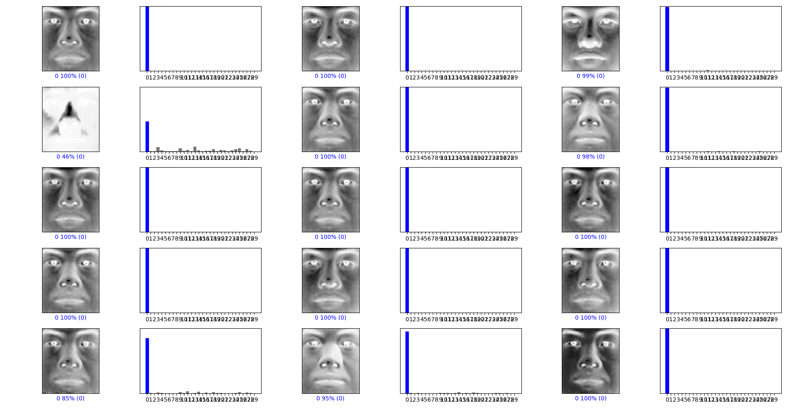
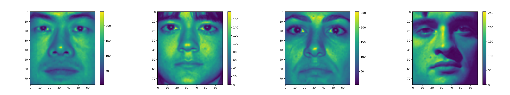
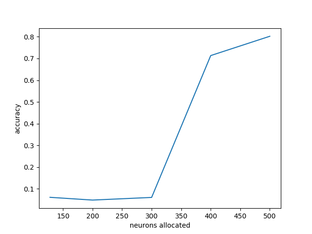
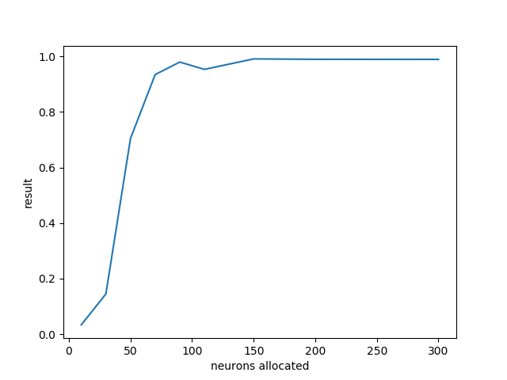

# Introduction
This report outlines the approach that was taken in completing a biometric recognition task in which it was attempted to get the highest efficiency possible.
In this particular scenario, it was received a dataset composed of 50 photos of 30 different people, where each one of those pictures was taken under different lighting conditions and some from different angles. The challenge was to design a system that could match the right photo to the correct person. Every single one of the photos had a resolution of `68x77 px`, they all come in black and white and were cropped down to only show the face of the person. 

# DESIGNING A SOLUTION
From the various technology options available, it was chosen to use `Python` as the main programing language, alongside with TensorFlow as an end-to-end open-source platform for machine learning, which can be used to build `Convolutional Networks` that can solve problems similar to the one given.
	
The dataset given was already normalized, as previously mentioned, all of the pictures were already resized to the same size, converted to grayscale and contained just the face of the individuals, the only issue with these was that they were not properly labeled or indexed. Though after further examination, it found that all images contained an integer value that identified them to the person that they belonged to.

### yaleB`02`_P00A+000E+45.jpg

**Convolutional Neural** Networks operate in layers, where the front one, in this case, should have been a **Flatten layer**, which would have taken as an input the decimal value that results by multiplying the height and width (in pixels) of the training data but since the dataset provided was already uniformly resized to a resolution of 68 by 77 pixels this step was unnecessary. The lower the value the more accurate the neural network predictions are going to be which is why during the normalization process it is good practice to decrease the resolution of the files before any further processing and crop them to show merely the area of interest.


For the second layer, it was used a **Dense layer**, which was responsible for connecting each input to each output within its layer, also used as an **activation layer** with a **rectified linear unit also known as “RELU”** as an activation function, which has been extremely popular for the past few years and well known and appreciated for its performance in the detriment of Sigmoid or Tanh which on the other hand, involve expensive operations while learning. RELU learns faster and avoids the vanishing gradient problem, besides that, almost all deep learning networks use RELU nowadays, but only for the **hidden layers.**

For the last layer, also known as the output layer, it was used another Dense layer which had 30 neurons, where the value of neurons came from the number of possible outputs, which in this case was 30.
For the model optimizer, it was chosen **ADAM** because it was the one suggested by TensorFlow when handling image classification.

```python
def create_model():
    model = keras.Sequential([
        keras.layers.Flatten(input_shape=(77, 68)),
        keras.layers.Dense(128, activation='relu'),
        keras.layers.Dense(30)
    ])

    model.compile(optimizer='adam',
                loss=tf.keras.losses.SparseCategoricalCrossentropy(from_logits=True),
                metrics=['accuracy'])

    return model

```

# MAPPING THE IMAGES
Since the images given were not classified in any particular way it was made use of the pattern that was observed in file names to design a script that would index them according to the person that they belonged to. 

The first attempt was to loop through all of the photos within the respective directory and pick up their names and match them to the right person by slicing the part of the image filenames that represented that person, these names would then be put in a list which was then stored in a CSV file that would then be used to feed the photo dataset to the neuronal network. The problem that was encountered was that it was proving itself to be troublesome to load the data out of the file to the neuronal network. Ultimately, for the sake of saving time it was decided to instead try another method to load up the data.

The other method was to separate the dataset, instead of saving the results into a CSV file, it was created separate directories for each classifier (individual) to where the script would move all of the respective pictures.
```
├───02
│       yaleB02_P00A+000E+00.jpg
│       yaleB02_P00A+000E+20.jpg
...
├───03
│       yaleB03_P00A+000E+00.jpg
│       yaleB03_P00A-005E+10.jpg
...
│
├───04
│       yaleB04_P00A+000E+00.jpg
│       yaleB04_P00A+000E+20.jpg
```

# PREPROCESSING THE DATA
One significant aspect that was forgotten about was that before sending the data for processing in the neural network, it was necessary to examine the images and see in which range the pixel values fell in. For example, the picture with the woman from the left side had pixel values from `0 to ~170` and on the right side, the values fell in between `0 and ~255.`



This step was reproduced several times until it was determined their highest possible value. Due to using the object `“numpy.ndarray”`,  which is the object that is used for storing each photo as a dual dimensional array.


It was decided to divide the list by *255* to get results within `0 and 1` which are more comfortable to deal with. The importance of this step is crucial because it *directly affects accuracy.*

```python
(training_images, training_labels) = create_training_data()
training_images = np.array(training_images)
training_images = training_images / 255.0

X_train, X_test, y_train, y_test = train_test_split(
    training_images, training_labels, test_size=0.3, random_state=42)
  ```
  
Before the previous decision of dividing the pixel gradient results that were stored in the `“numpy.ndarray” object` by 255, it had been decided to allocate more than 400 neurons to the hidden layer which had previously resulted in the neural network getting an accuracy of 80%. It was estimated that the costs involved in building the models were too high and that the accuracy was too poor by contrast.



However, after said division, as shown in the second image from below, the accuracy per neurons allocated improved quite drastically in comparison to how it previously was. 



# FINDING THE APPROPRIATE NUMBER OF NEURONS FOR THE HIDDEN LAYER
For the hidden layer, it was conducted multiple tests where it was tweaked the number of neurons allocated and registered the accuracy as shown in the graph above. Here it was discovered that once the layer has allocated `more than 100 neurons` the accuracy rate is nearly 100% so in order to keep the neural network efficient and avoid going beyond the point of diminishing returns it was reduced the number of computations required it was decided to go with a value of `130 allocated neurons. `

# SPLITTING THE DATA
To obtain realistic results it was decided to divide the data into two segments: `training data`, which would be used exclusively for the training process and `test data`, which would then be used when reevaluating the model after being trained. The reason why it was chosen to take this approach was that it is the sole purpose of a neural network to be able to categorize new data correctly, showing the same data to a neural network would go against the reason of their creation and their use-cases. 

The ratio that was used for distributing the datasets was 0.3%. Below it was attached a plot that shows how accurate the solution is. 

# REFERENCES
1.	The Most Intuitive and Easiest Guide for Convolutional Neural Network by Jiwon Jeong
2.	Basic classification: Classify images of clothing by Tensorflow
3.	Learning resources by Tensorflow
4.	TensorFlow 2.0 Full Tutorial - Python Neural Networks for Beginners by freeCodeCamp.org
5.	how to split data into training and testing from stackoverflow
6.	Keras documentation
7.	Activation Functions in Neural Networks
